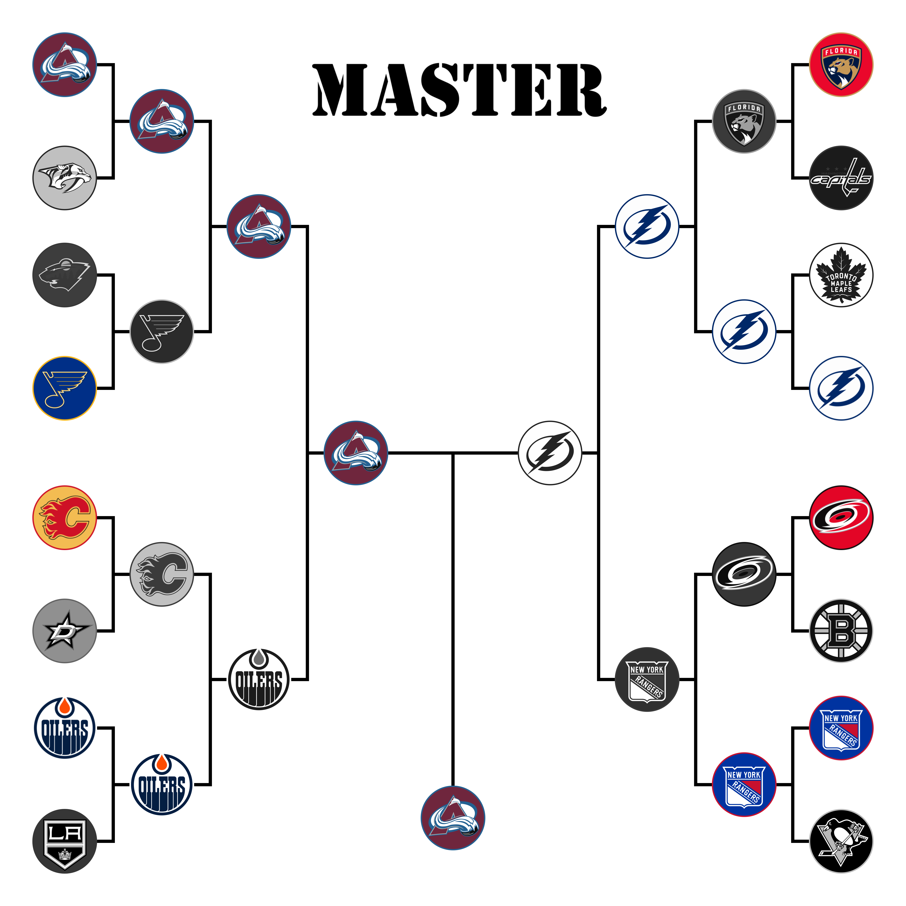
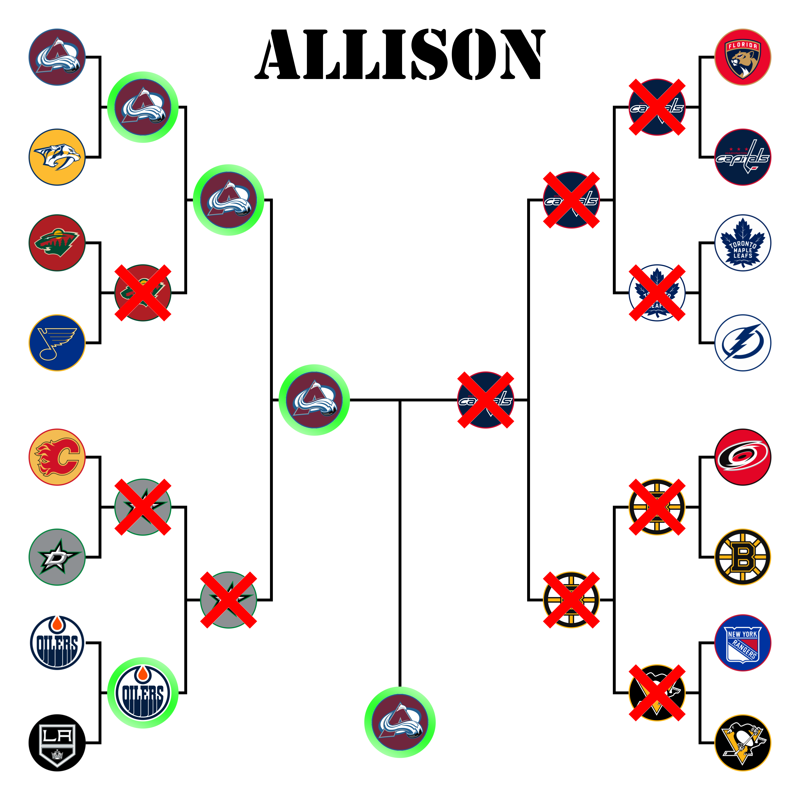

# Office NHL Bracket Challenge

Thank you everyone who submitted a bracket. I enjoyed making this page and I hope you enjoy it as well.

## Stanley Cup Results
### Bracket

### Round 1  
  
<table>
  <tr>
    <th> </th>
    <th>Game 1</th>
    <th>Game 2</th>
    <th>Game 3</th>
    <th>Game 4</th>
    <th>Game 5</th>
    <th>Game 6</th>
    <th>Game 7</th>
  </tr>
  <tr>
    <td style="background-color: green">Avalanche</td>
    <td style="background-color: green">7</td>
    <td style="background-color: green">2</td>
    <td style="background-color: green">7</td>
    <td style="background-color: green">5</td>
    <td> </td>
    <td> </td>
    <td> </td>
  </tr>
  <tr>
    <td>Predators</td>
    <td>2</td>
    <td>1</td>
    <td>3</td>
    <td>3</td>
    <td> </td>
    <td> </td>
    <td> </td>
  </tr>
</table>

## Bracket Standings

## Individual Brackets
### Allie

### Allison
