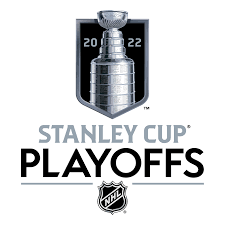
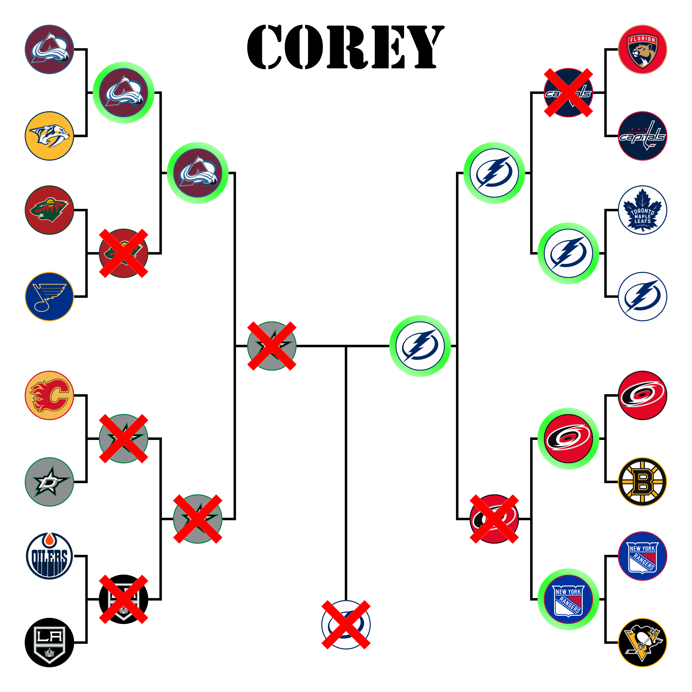
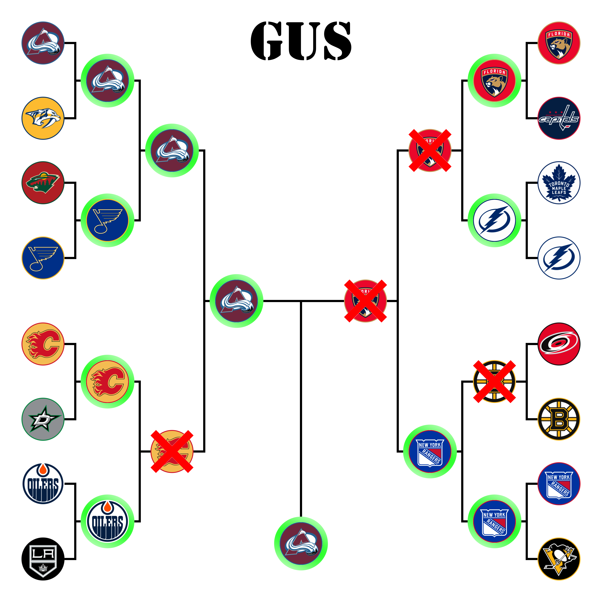
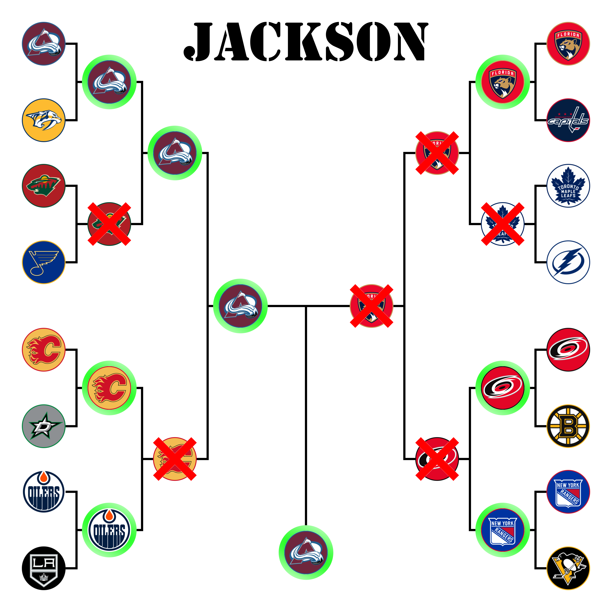
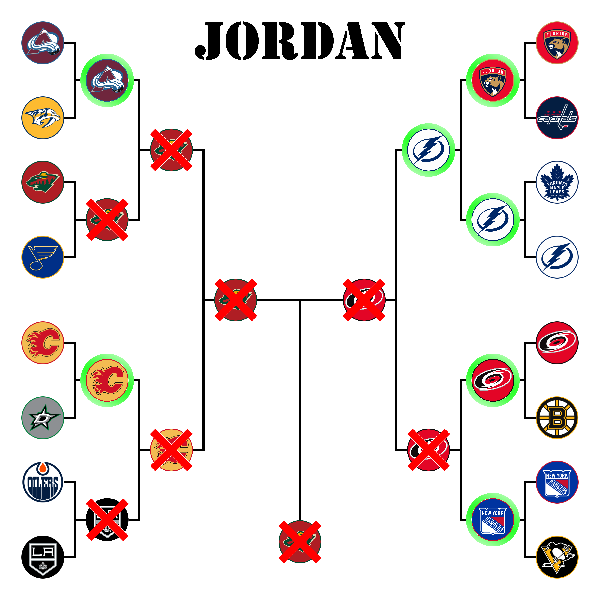
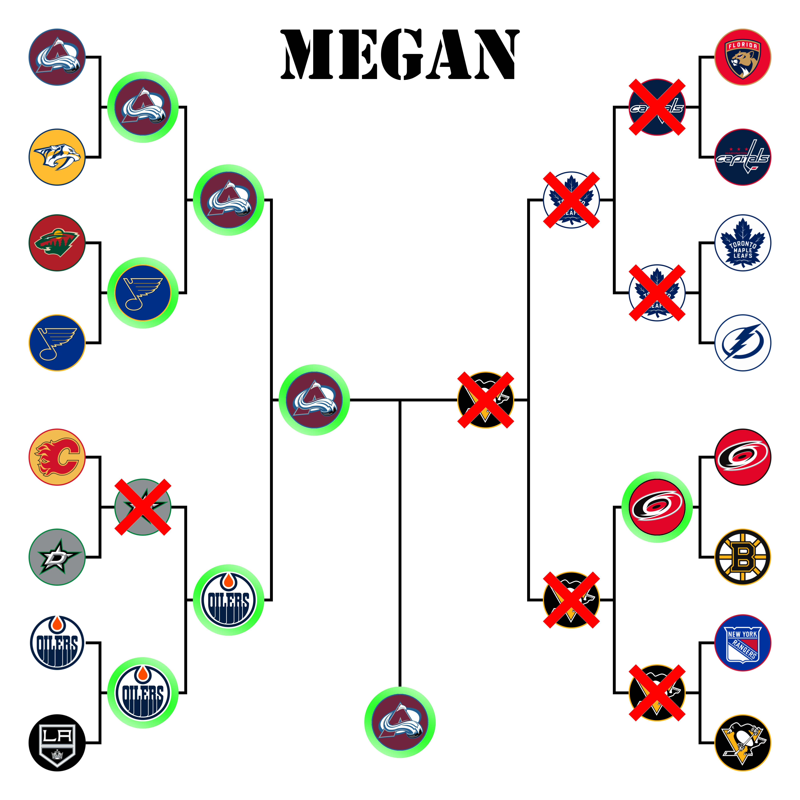
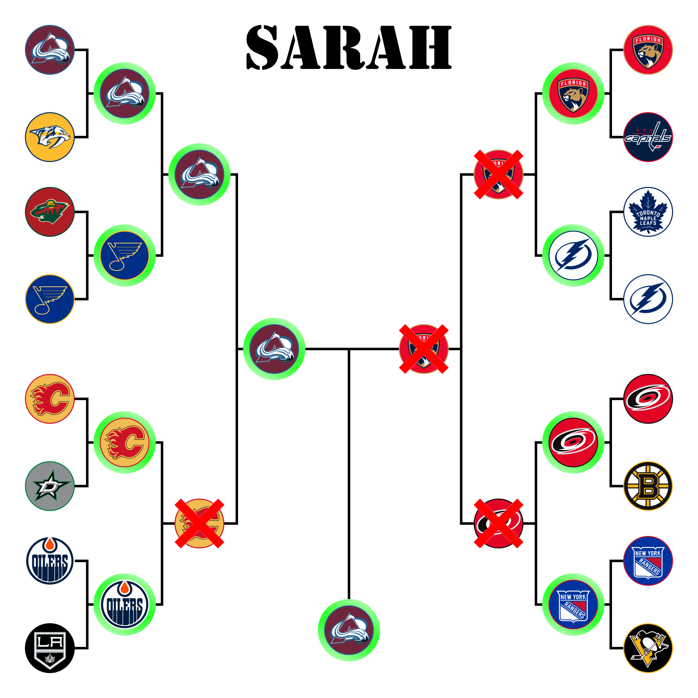

# Office NHL Bracket Challenge

Thank you everyone who submitted a bracket. I enjoyed making this page and I hope you enjoy it as well.

## Stanley Cup Results
### Bracket

### Round 1  

< !╌ Avs Preds╌>
<table>
  <tr>
    <th> </th>
    <th>Game 1</th>
    <th>Game 2</th>
    <th>Game 3</th>
    <th>Game 4</th>
    <th>Game 5</th>
    <th>Game 6</th>
    <th>Game 7</th>
  </tr>
  <tr>
    <td style="background-color: green">Avalanche</td>
    <td style="background-color: green">7</td>
    <td style="background-color: green">2</td>
    <td style="background-color: green">7</td>
    <td style="background-color: green">5</td>
    <td> </td>
    <td> </td>
    <td> </td>
  </tr>
  <tr>
    <td>Predators</td>
    <td>2</td>
    <td>1</td>
    <td>3</td>
    <td>3</td>
    <td> </td>
    <td> </td>
    <td> </td>
  </tr>
</table>

< !╌ Wild Blues╌>
<table>
  <tr>
    <th> </th>
    <th>Game 1</th>
    <th>Game 2</th>
    <th>Game 3</th>
    <th>Game 4</th>
    <th>Game 5</th>
    <th>Game 6</th>
    <th>Game 7</th>
  </tr>
  <tr>
    <td>Wild</td>
    <td >0</td>
    <td style="background-color: green">6</td>
    <td style="background-color: green">5</td>
    <td >2</td>
    <td> 2</td>
    <td> 1</td>
    <td> </td>
  </tr>
  <tr>
    <td style="background-color: green">Blues</td>
    <td style="background-color: green">4</td>
    <td>2</td>
    <td>1</td>
    <td style="background-color: green">5</td>
    <td style="background-color: green">5</td>
    <td style="background-color: green">5</td>
    <td> </td>
  </tr>
</table>

< !╌ Flames Stars╌>
< !-- 
<table>
  <tr>
    <th> </th>
    <th>Game 1</th>
    <th>Game 2</th>
    <th>Game 3</th>
    <th>Game 4</th>
    <th>Game 5</th>
    <th>Game 6</th>
    <th>Game 7</th>
  </tr>
  <tr>
    <td>Avalanche</td>
    <td>7</td>
    <td style="background-color: green">2</td>
    <td style="background-color: green">7</td>
    <td style="background-color: green">5</td>
    <td> </td>
    <td> </td>
    <td> </td>
  </tr>
  <tr>
    <td>Predators</td>
    <td>2</td>
    <td>1</td>
    <td>3</td>
    <td>3</td>
    <td> </td>
    <td> </td>
    <td> </td>
  </tr>
</table>
-->
< !╌ Oilers Kings╌>
< !╌
<table>
  <tr>
    <th> </th>
    <th>Game 1</th>
    <th>Game 2</th>
    <th>Game 3</th>
    <th>Game 4</th>
    <th>Game 5</th>
    <th>Game 6</th>
    <th>Game 7</th>
  </tr>
  <tr>
    <td style="background-color: green">Avalanche</td>
    <td style="background-color: green">7</td>
    <td style="background-color: green">2</td>
    <td style="background-color: green">7</td>
    <td style="background-color: green">5</td>
    <td> </td>
    <td> </td>
    <td> </td>
  </tr>
  <tr>
    <td>Predators</td>
    <td>2</td>
    <td>1</td>
    <td>3</td>
    <td>3</td>
    <td> </td>
    <td> </td>
    <td> </td>
  </tr>
</table>
-->
< !╌ Panthers Caps╌>
< !╌
<table>
  <tr>
    <th> </th>
    <th>Game 1</th>
    <th>Game 2</th>
    <th>Game 3</th>
    <th>Game 4</th>
    <th>Game 5</th>
    <th>Game 6</th>
    <th>Game 7</th>
  </tr>
  <tr>
    <td style="background-color: green">Avalanche</td>
    <td style="background-color: green">7</td>
    <td style="background-color: green">2</td>
    <td style="background-color: green">7</td>
    <td style="background-color: green">5</td>
    <td> </td>
    <td> </td>
    <td> </td>
  </tr>
  <tr>
    <td>Predators</td>
    <td>2</td>
    <td>1</td>
    <td>3</td>
    <td>3</td>
    <td> </td>
    <td> </td>
    <td> </td>
  </tr>
</table>
-->
< !╌ Maple Leafs Bolts╌>
< !╌
<table>
  <tr>
    <th> </th>
    <th>Game 1</th>
    <th>Game 2</th>
    <th>Game 3</th>
    <th>Game 4</th>
    <th>Game 5</th>
    <th>Game 6</th>
    <th>Game 7</th>
  </tr>
  <tr>
    <td style="background-color: green">Avalanche</td>
    <td style="background-color: green">7</td>
    <td style="background-color: green">2</td>
    <td style="background-color: green">7</td>
    <td style="background-color: green">5</td>
    <td> </td>
    <td> </td>
    <td> </td>
  </tr>
  <tr>
    <td>Predators</td>
    <td>2</td>
    <td>1</td>
    <td>3</td>
    <td>3</td>
    <td> </td>
    <td> </td>
    <td> </td>
  </tr>
</table>
-->
< !╌ Canes Bruins╌>
< !╌
<table>
  <tr>
    <th> </th>
    <th>Game 1</th>
    <th>Game 2</th>
    <th>Game 3</th>
    <th>Game 4</th>
    <th>Game 5</th>
    <th>Game 6</th>
    <th>Game 7</th>
  </tr>
  <tr>
    <td style="background-color: green">Avalanche</td>
    <td style="background-color: green">7</td>
    <td style="background-color: green">2</td>
    <td style="background-color: green">7</td>
    <td style="background-color: green">5</td>
    <td> </td>
    <td> </td>
    <td> </td>
  </tr>
  <tr>
    <td>Predators</td>
    <td>2</td>
    <td>1</td>
    <td>3</td>
    <td>3</td>
    <td> </td>
    <td> </td>
    <td> </td>
  </tr>
</table>
-->
< !╌ Rangers Penguins╌>
< !╌
<table>
  <tr>
    <th> </th>
    <th>Game 1</th>
    <th>Game 2</th>
    <th>Game 3</th>
    <th>Game 4</th>
    <th>Game 5</th>
    <th>Game 6</th>
    <th>Game 7</th>
  </tr>
  <tr>
    <td style="background-color: green">Avalanche</td>
    <td style="background-color: green">7</td>
    <td style="background-color: green">2</td>
    <td style="background-color: green">7</td>
    <td style="background-color: green">5</td>
    <td> </td>
    <td> </td>
    <td> </td>
  </tr>
  <tr>
    <td>Predators</td>
    <td>2</td>
    <td>1</td>
    <td>3</td>
    <td>3</td>
    <td> </td>
    <td> </td>
    <td> </td>
  </tr>
</table>
-->

### Round 2

### Conference Finals

### Stanley Cup Finals

## Bracket Standings
### Sorted by Name

### Sorted by Points

### Sorted by Total Possible Points

## Individual Brackets
### Allie

### Allison

### Caroline

### Corey

### Daniel

### Felix

### Gus

### Isabella

### Jackson

### Jordan

### Lydia

### Megan

### Mike

### Rob

### Sarah

### Tyler

### Xander
