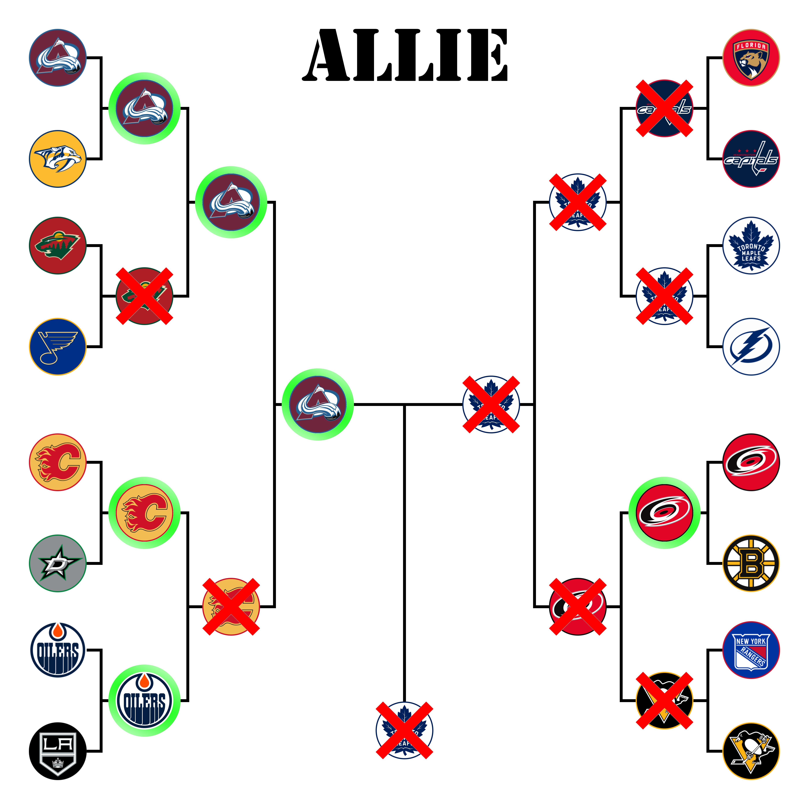
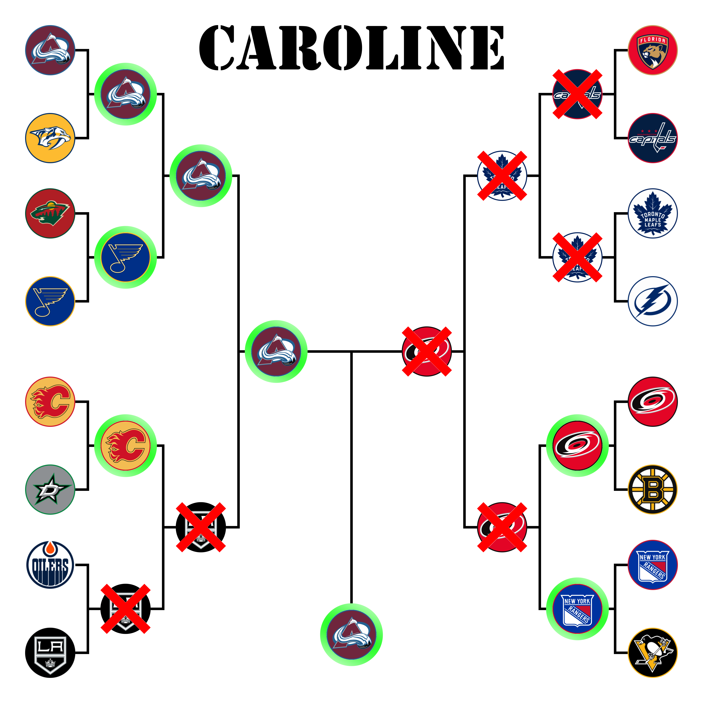
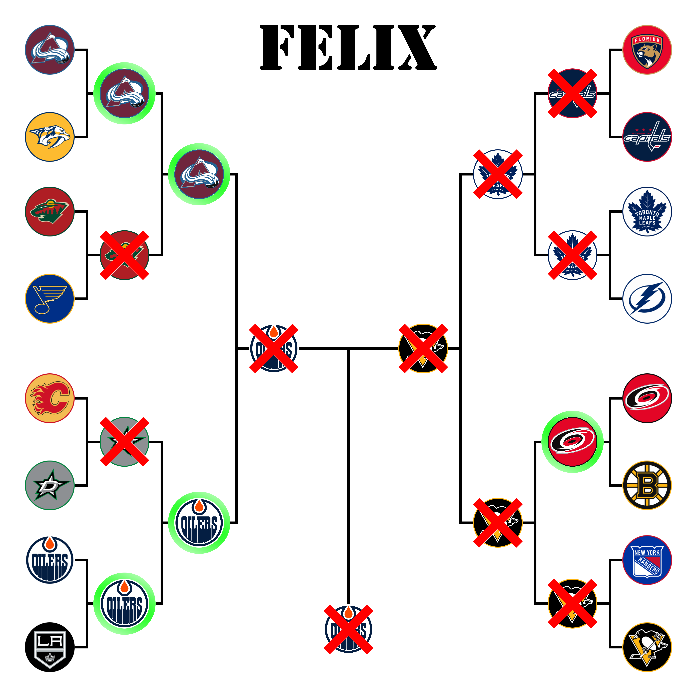
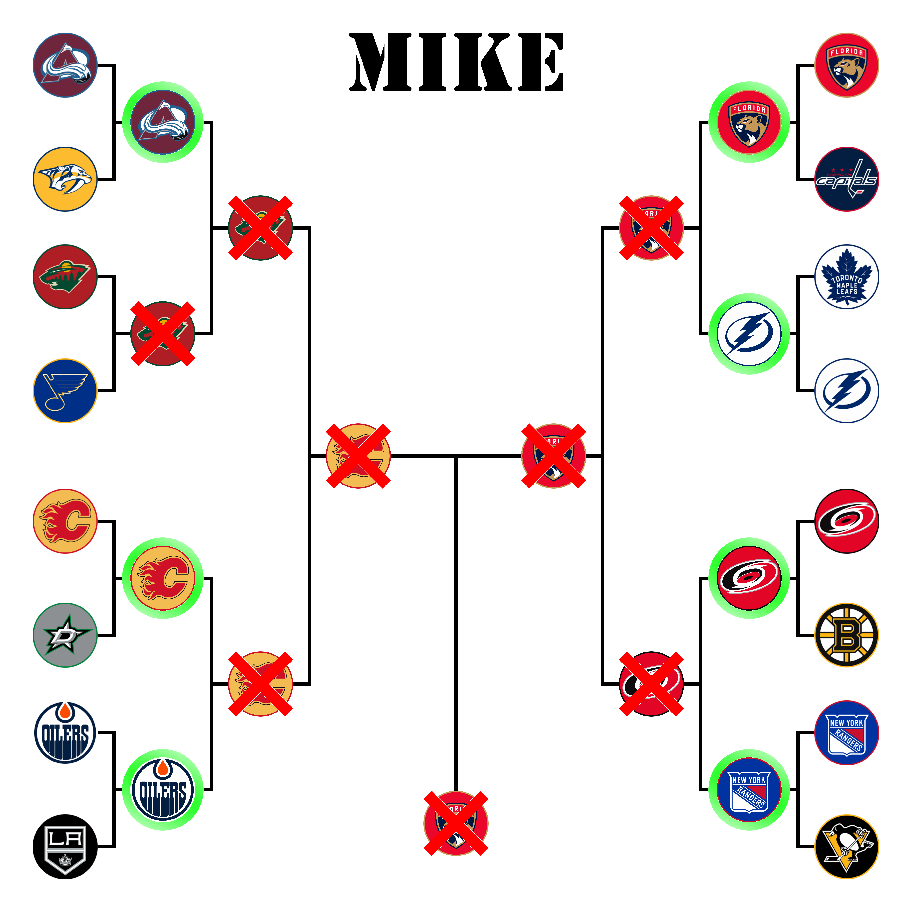
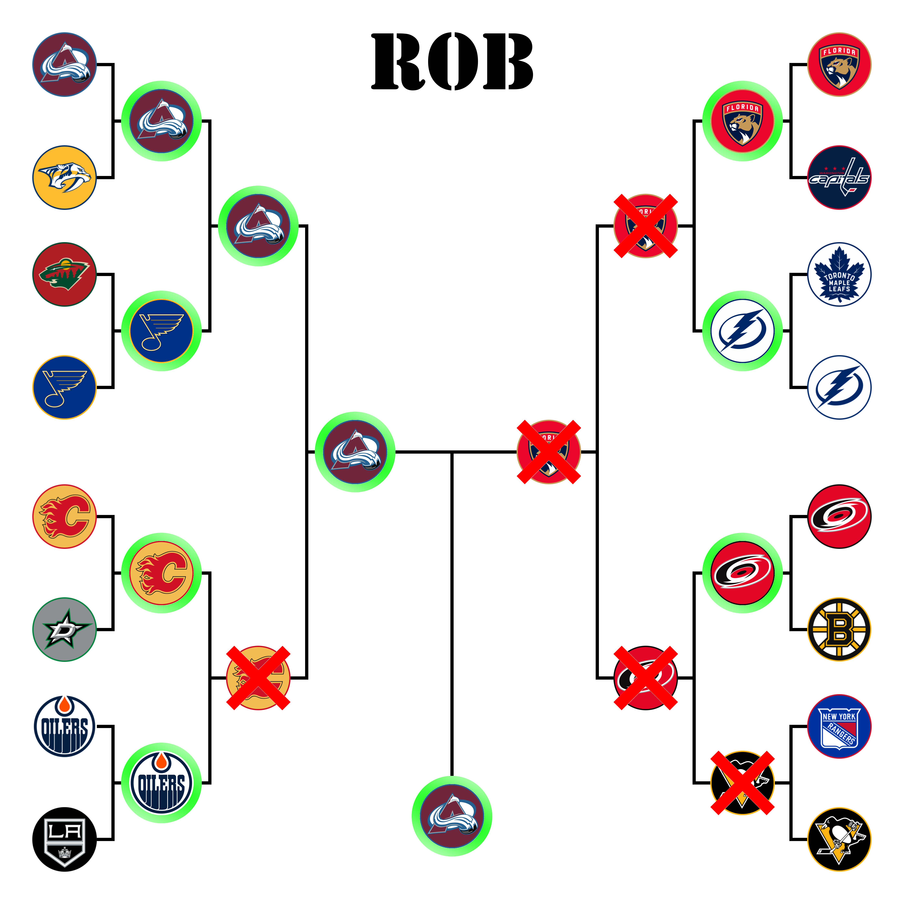

# Office NHL Bracket Challenge

Thank you everyone who submitted a bracket. I enjoyed making this page and I hope you enjoy it as well.

## Stanley Cup Results
### Bracket

### Round 2  

<table>
  <tr>
    <th> </th>
    <th>Game 1</th>
    <th>Game 2</th>
    <th>Game 3</th>
    <th>Game 4</th>
    <th>Game 5</th>
    <th>Game 6</th>
    <th>Game 7</th>
    <th>Total Wins</th>
  </tr>
  <tr>
    <td style="background-color: green">Avalanche</td>
    <td style="background-color: green">3</td>
    <td>1</td>
    <td style="background-color: green">5</td>
    <td style="background-color: green">6</td>
    <td>4</td>
    <td style="background-color: green">3</td>
    <td> </td>
    <td>4</td>
  </tr>
  <tr>
    <td>Blues</td>
    <td>2</td>
    <td style="background-color: green">4</td>
    <td>2</td>
    <td>3</td>
    <td style="background-color: green">5</td>
    <td>2</td>
    <td> </td>
    <td>2</td>
  </tr>
</table>

<table>
  <tr>
    <th> </th>
    <th>Game 1</th>
    <th>Game 2</th>
    <th>Game 3</th>
    <th>Game 4</th>
    <th>Game 5</th>
    <th>Game 6</th>
    <th>Game 7</th>
    <th>Total Wins</th>
  </tr>
  <tr>
    <td>Flames</td>
    <td style="background-color: green">9</td>
    <td>3</td>
    <td>1</td>
    <td>3</td>
    <td>4</td>
    <td> </td>
    <td> </td>
    <td>1</td>
  </tr>
  <tr>
    <td style="background-color: green">Oilers</td>
    <td>6</td>
    <td style="background-color: green">5</td>
    <td style="background-color: green">4</td>
    <td style="background-color: green">5</td>
    <td style="background-color: green">5</td>
    <td> </td>
    <td> </td>
    <td>4</td>
  </tr>
</table>

<table>
  <tr>
    <th> </th>
    <th>Game 1</th>
    <th>Game 2</th>
    <th>Game 3</th>
    <th>Game 4</th>
    <th>Game 5</th>
    <th>Game 6</th>
    <th>Game 7</th>
    <th>Total Wins</th>
  </tr>
  <tr>
    <td>Panthers</td>
    <td>1</td>
    <td>1</td>
    <td>1</td>
    <td>0</td>
    <td> </td>
    <td> </td>
    <td> </td>
    <td>0</td>
  </tr>
  <tr>
    <td style="background-color: green">Lightning</td>
    <td style="background-color: green">4</td>
    <td style="background-color: green">2</td>
    <td style="background-color: green">5</td>
    <td style="background-color: green">2</td>
    <td> </td>
    <td> </td>
    <td> </td>
    <td>4</td>
  </tr>
</table>

<table>
  <tr>
    <th> </th>
    <th>Game 1</th>
    <th>Game 2</th>
    <th>Game 3</th>
    <th>Game 4</th>
    <th>Game 5</th>
    <th>Game 6</th>
    <th>Game 7</th>
    <th>Total Wins</th>
  </tr>
  <tr>
    <td>Hurricanes</td>
    <td style="background-color: green">2</td>
    <td style="background-color: green">2</td>
    <td>1</td>
    <td>1</td>
    <td style="background-color: green">3</td>
    <td> </td>
    <td> </td>
    <td>3</td>
  </tr>
  <tr>
    <td>Rangers</td>
    <td>1</td>
    <td>0</td>
    <td style="background-color: green">3</td>
    <td style="background-color: green">4</td>
    <td>1</td>
    <td> </td>
    <td> </td>
    <td>2</td>
  </tr>
</table>

### Conference Finals  

<table>
  <tr>
    <th> </th>
    <th>Game 1</th>
    <th>Game 2</th>
    <th>Game 3</th>
    <th>Game 4</th>
    <th>Game 5</th>
    <th>Game 6</th>
    <th>Game 7</th>
    <th>Total Wins</th>
  </tr>
  <tr>
    <td>Avalanche</td>
    <td> </td>
    <td> </td>
    <td> </td>
    <td> </td>
    <td> </td>
    <td> </td>
    <td> </td>
    <td>0</td>
  </tr>
  <tr>
    <td>Oilers</td>
    <td> </td>
    <td> </td>
    <td> </td>
    <td> </td>
    <td> </td>
    <td> </td>
    <td> </td>
    <td>0</td>
  </tr>
</table>

<table>
  <tr>
    <th> </th>
    <th>Game 1</th>
    <th>Game 2</th>
    <th>Game 3</th>
    <th>Game 4</th>
    <th>Game 5</th>
    <th>Game 6</th>
    <th>Game 7</th>
    <th>Total Wins</th>
  </tr>
  <tr>
    <td></td>
    <td> </td>
    <td> </td>
    <td> </td>
    <td> </td>
    <td> </td>
    <td> </td>
    <td> </td>
    <td></td>
  </tr>
  <tr>
    <td></td>
    <td> </td>
    <td> </td>
    <td> </td>
    <td> </td>
    <td> </td>
    <td> </td>
    <td> </td>
    <td></td>
  </tr>
</table>

### Stanley Cup Finals  

<table>
  <tr>
    <th> </th>
    <th>Game 1</th>
    <th>Game 2</th>
    <th>Game 3</th>
    <th>Game 4</th>
    <th>Game 5</th>
    <th>Game 6</th>
    <th>Game 7</th>
    <th>Total Wins</th>
  </tr>
  <tr>
    <td></td>
    <td> </td>
    <td> </td>
    <td> </td>
    <td> </td>
    <td> </td>
    <td> </td>
    <td> </td>
    <td></td>
  </tr>
  <tr>
    <td></td>
    <td> </td>
    <td> </td>
    <td> </td>
    <td> </td>
    <td> </td>
    <td> </td>
    <td> </td>
    <td></td>
  </tr>
</table>

### Round 1  

<table>
  <tr>
    <th> </th>
    <th>Game 1</th>
    <th>Game 2</th>
    <th>Game 3</th>
    <th>Game 4</th>
    <th>Game 5</th>
    <th>Game 6</th>
    <th>Game 7</th>
    <th>Total Wins</th>
  </tr>
  <tr>
    <td style="background-color: green">Avalanche</td>
    <td style="background-color: green">7</td>
    <td style="background-color: green">2</td>
    <td style="background-color: green">7</td>
    <td style="background-color: green">5</td>
    <td> </td>
    <td> </td>
    <td> </td>
    <td>4</td>
  </tr>
  <tr>
    <td>Predators</td>
    <td>2</td>
    <td>1</td>
    <td>3</td>
    <td>3</td>
    <td> </td>
    <td> </td>
    <td> </td>
    <td>0</td>
  </tr>
</table>

<table>
  <tr>
    <th> </th>
    <th>Game 1</th>
    <th>Game 2</th>
    <th>Game 3</th>
    <th>Game 4</th>
    <th>Game 5</th>
    <th>Game 6</th>
    <th>Game 7</th>
    <th>Total Wins</th>
  </tr>
  <tr>
    <td>Wild</td>
    <td>0</td>
    <td style="background-color: green">6</td>
    <td style="background-color: green">5</td>
    <td>2</td>
    <td>2</td>
    <td>1</td>
    <td> </td>
    <td>2</td>
  </tr>
  <tr>
    <td style="background-color: green">Blues</td>
    <td style="background-color: green">4</td>
    <td>2</td>
    <td>1</td>
    <td style="background-color: green">5</td>
    <td style="background-color: green">5</td>
    <td style="background-color: green">5</td>
    <td> </td>
    <td>4</td>
  </tr>
</table>

<table>
  <tr>
    <th> </th>
    <th>Game 1</th>
    <th>Game 2</th>
    <th>Game 3</th>
    <th>Game 4</th>
    <th>Game 5</th>
    <th>Game 6</th>
    <th>Game 7</th>
    <th>Total Wins</th>
  </tr>
  <tr>
    <td style="background-color: green">Flames</td>
    <td style="background-color: green">1</td>
    <td>0</td>
    <td>2</td>
    <td style="background-color: green">4</td>
    <td style="background-color: green">3</td>
    <td>2</td>
    <td style="background-color: green">3</td>
    <td>4</td>
  </tr>
  <tr>
    <td>Stars</td>
    <td>0</td>
    <td style="background-color: green">2</td>
    <td style="background-color: green">4</td>
    <td>1</td>
    <td>1</td>
    <td style="background-color: green">4</td>
    <td>2</td>
    <td>3</td>
  </tr>
</table>

<table>
  <tr>
    <th> </th>
    <th>Game 1</th>
    <th>Game 2</th>
    <th>Game 3</th>
    <th>Game 4</th>
    <th>Game 5</th>
    <th>Game 6</th>
    <th>Game 7</th>
    <th>Total Wins</th>
  </tr>
  <tr>
    <td style="background-color: green">Oilers</td>
    <td>3</td>
    <td style="background-color: green">6</td>
    <td style="background-color: green">8</td>
    <td>0</td>
    <td>4</td>
    <td style="background-color: green">4</td>
    <td style="background-color: green">2</td>
    <td>4</td>
  </tr>
  <tr>
    <td>Kings</td>
    <td style="background-color: green">4</td>
    <td>0</td>
    <td>2</td>
    <td style="background-color: green">4</td>
    <td style="background-color: green">5</td>
    <td>2</td>
    <td>0</td>
    <td>3</td>
  </tr>
</table>

<table>
  <tr>
    <th> </th>
    <th>Game 1</th>
    <th>Game 2</th>
    <th>Game 3</th>
    <th>Game 4</th>
    <th>Game 5</th>
    <th>Game 6</th>
    <th>Game 7</th>
    <th>Total Wins</th>
  </tr>
  <tr>
    <td style="background-color: green">Panthers</td>
    <td>2</td>
    <td style="background-color: green">5</td>
    <td>1</td>
    <td style="background-color: green">3</td>
    <td style="background-color: green">5</td>
    <td style="background-color: green">4</td>
    <td> </td>
    <td>4</td>
  </tr>
  <tr>
    <td>Capitals</td>
    <td style="background-color: green">4</td>
    <td>1</td>
    <td style="background-color: green">6</td>
    <td>2</td>
    <td>3</td>
    <td>3</td>
    <td> </td>
    <td>2</td>
  </tr>
</table>

<table>
  <tr>
    <th> </th>
    <th>Game 1</th>
    <th>Game 2</th>
    <th>Game 3</th>
    <th>Game 4</th>
    <th>Game 5</th>
    <th>Game 6</th>
    <th>Game 7</th>
    <th>Total Wins</th>
  </tr>
  <tr>
    <td>Maple Leafs</td>
    <td style="background-color: green">5</td>
    <td>3</td>
    <td style="background-color: green">5</td>
    <td>3</td>
    <td style="background-color: green">4</td>
    <td>3</td>
    <td>1</td>
    <td>3</td>
  </tr>
  <tr>
    <td style="background-color: green">Lightning</td>
    <td>0</td>
    <td style="background-color: green">5</td>
    <td>2</td>
    <td style="background-color: green">7</td>
    <td>3</td>
    <td style="background-color: green">4</td>
    <td style="background-color: green">2</td>
    <td>4</td>
  </tr>
</table>

<table>
  <tr>
    <th> </th>
    <th>Game 1</th>
    <th>Game 2</th>
    <th>Game 3</th>
    <th>Game 4</th>
    <th>Game 5</th>
    <th>Game 6</th>
    <th>Game 7</th>
    <th>Total Wins</th>
  </tr>
  <tr>
    <td style="background-color: green">Hurricanes</td>
    <td style="background-color: green">5</td>
    <td style="background-color: green">5</td>
    <td>2</td>
    <td>2</td>
    <td style="background-color: green">5</td>
    <td>2</td>
    <td style="background-color: green">3</td>
    <td>4</td>
  </tr>
  <tr>
    <td>Bruins</td>
    <td>1</td>
    <td>2</td>
    <td style="background-color: green">4</td>
    <td style="background-color: green">5</td>
    <td>1</td>
    <td style="background-color: green">5</td>
    <td>2</td>
    <td>3</td>
  </tr>
</table>

<table>
  <tr>
    <th> </th>
    <th>Game 1</th>
    <th>Game 2</th>
    <th>Game 3</th>
    <th>Game 4</th>
    <th>Game 5</th>
    <th>Game 6</th>
    <th>Game 7</th>
    <th>Total Wins</th>
  </tr>
  <tr>
    <td style="background-color: green">Rangers</td>
    <td>3</td>
    <td style="background-color: green">5</td>
    <td>4</td>
    <td>2</td>
    <td style="background-color: green">5</td>
    <td style="background-color: green">5</td>
    <td style="background-color: green">4</td>
    <td>4</td>
  </tr>
  <tr>
    <td>Penguins</td>
    <td style="background-color: green">4</td>
    <td>2</td>
    <td style="background-color: green">7</td>
    <td style="background-color: green">7</td>
    <td>3</td>
    <td>3</td>
    <td>3</td>
    <td>3</td>
  </tr>
</table>

## Bracket Standings
How the scoring works
* 10 : Correct Round 1 Winners
* 25 : Correct Round 2 Winners
* 50 : Correct Conference Finals Champions
* 100: Correct Stanley Cup Champion

TPP: Total Points Possible
### Sorted by Name
<table>
  <tr>
    <th>Name</th>
    <th>Points</th>
    <th>TPP</th>
  </tr>
  <tr>
    <td>Allie</td>
    <td>65</td>
    <td>140</td>
  </tr>
  <tr>
    <td>Allison</td>
    <td>45</td>
    <td>195</td>
  </tr>
  <tr>
    <td>Caroline</td>
    <td>75</td>
    <td>300</td>
  </tr>
  <tr>
    <td>Corey</td>
    <td>90</td>
    <td>265</td>
  </tr>
  <tr>
    <td>Daniel</td>
    <td>30</td>
    <td>30</td>
  </tr>
  <tr>
    <td>Felix</td>
    <td>80</td>
    <td>230</td>
  </tr>
  <tr>
    <td>Gus</td>
    <td>95</td>
    <td>270</td>
  </tr>
  <tr>
    <td>Isabella</td>
    <td>65</td>
    <td>290</td>
  </tr>
  <tr>
    <td>Jackson</td>
    <td>85</td>
    <td>260</td>
  </tr>
  <tr>
    <td>Jordan</td>
    <td>85</td>
    <td>160</td>
  </tr>
  <tr>
    <td>Lydia</td>
    <td>75</td>
    <td>225</td>
  </tr>
  <tr>
    <td>Megan</td>
    <td>90</td>
    <td>240</td>
  </tr>
  <tr>
    <td>Mike</td>
    <td>70</td>
    <td>95</td>
  </tr>
  <tr>
    <td>Rob</td>
    <td>95</td>
    <td>270</td>
  </tr>
  <tr>
    <td>Sarah</td>
    <td>105</td>
    <td>280</td>
  </tr>
  <tr>
    <td>Tyler</td>
    <td>75</td>
    <td>300</td>
  </tr>
  <tr>
    <td>Xander</td>
    <td>75</td>
    <td>125</td>
  </tr>
</table>

### Sorted by Points
<table>
  <tr>
    <th>Name</th>
    <th>Points</th>
    <th>TPP</th>
  </tr>
  <tr>
    <td>Sarah</td>
    <td>105</td>
    <td>280</td>
  </tr>
  <tr>
    <td>Gus</td>
    <td>95</td>
    <td>270</td>
  </tr>
  <tr>
    <td>Rob</td>
    <td>95</td>
    <td>270</td>
  </tr>
  <tr>
    <td>Corey</td>
    <td>90</td>
    <td>265</td>
  </tr>
  <tr>
    <td>Megan</td>
    <td>90</td>
    <td>240</td>
  </tr>
  <tr>
    <td>Jackson</td>
    <td>85</td>
    <td>260</td>
  </tr>
  <tr>
    <td>Jordan</td>
    <td>85</td>
    <td>160</td>
  </tr>
  <tr>
    <td>Felix</td>
    <td>80</td>
    <td>230</td>
  </tr>
  <tr>
    <td>Caroline</td>
    <td>75</td>
    <td>300</td>
  </tr>
  <tr>
    <td>Tyler</td>
    <td>75</td>
    <td>300</td>
  </tr>
  <tr>
    <td>Lydia</td>
    <td>75</td>
    <td>225</td>
  </tr>
  <tr>
    <td>Xander</td>
    <td>75</td>
    <td>125</td>
  </tr>
  <tr>
    <td>Mike</td>
    <td>70</td>
    <td>95</td>
  </tr>
  <tr>
    <td>Isabella</td>
    <td>65</td>
    <td>290</td>
  </tr>
  <tr>
    <td>Allie</td>
    <td>65</td>
    <td>140</td>
  </tr>
  <tr>
    <td>Allison</td>
    <td>45</td>
    <td>195</td>
  </tr>
  <tr>
    <td>Daniel</td>
    <td>30</td>
    <td>30</td>
  </tr>
</table>

### Sorted by Total Possible Points

<table>
  <tr>
    <th>Name</th>
    <th>Points</th>
    <th>TPP</th>
  </tr>
  <tr>
    <td>Caroline</td>
    <td>75</td>
    <td>300</td>
  </tr>
  <tr>
    <td>Tyler</td>
    <td>75</td>
    <td>300</td>
  </tr>
  <tr>
    <td>Isabella</td>
    <td>65</td>
    <td>290</td>
  </tr>
  <tr>
    <td>Sarah</td>
    <td>105</td>
    <td>280</td>
  </tr>
  <tr>
    <td>Gus</td>
    <td>95</td>
    <td>270</td>
  </tr>
  <tr>
    <td>Rob</td>
    <td>95</td>
    <td>270</td>
  </tr>
  <tr>
    <td>Corey</td>
    <td>90</td>
    <td>265</td>
  </tr>
  <tr>
    <td>Jackson</td>
    <td>85</td>
    <td>260</td>
  </tr>
  <tr>
    <td>Megan</td>
    <td>90</td>
    <td>240</td>
  </tr>
  <tr>
    <td>Felix</td>
    <td>80</td>
    <td>230</td>
  </tr>
  <tr>
    <td>Lydia</td>
    <td>75</td>
    <td>225</td>
  </tr>
  <tr>
    <td>Allison</td>
    <td>45</td>
    <td>195</td>
  </tr>
  <tr>
    <td>Jordan</td>
    <td>85</td>
    <td>160</td>
  </tr>
  <tr>
    <td>Allie</td>
    <td>65</td>
    <td>140</td>
  </tr>
  <tr>
    <td>Xander</td>
    <td>75</td>
    <td>125</td>
  </tr>
  <tr>
    <td>Mike</td>
    <td>70</td>
    <td>95</td>
  </tr>
  <tr>
    <td>Daniel</td>
    <td>30</td>
    <td>30</td>
  </tr>
</table>

## Individual Brackets
### Allie

### Allison

### Caroline

### Corey

### Daniel

### Felix

### Gus

### Isabella

### Jackson

### Jordan

### Lydia

### Megan

### Mike

### Rob

### Sarah

### Tyler

### Xander

